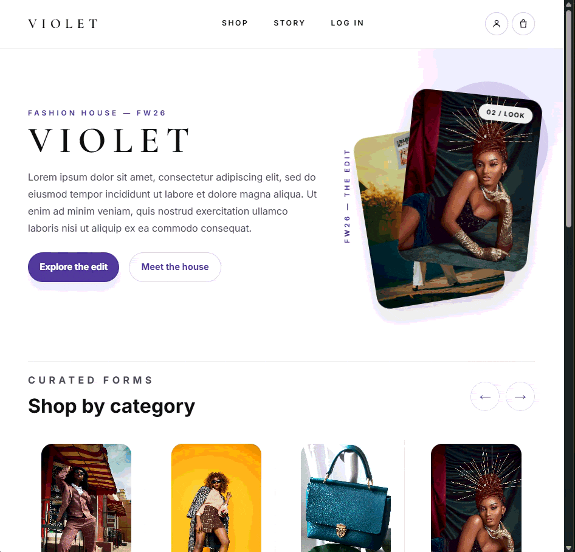

# VIOLET — E-commerce Full Stack

Full-stack fashion store with a React front-end and a Python (FastAPI) back-end, featuring persistent data in a SQL database, user authentication, a shopping cart, and a functional checkout flow.


---

## 📸 Preview

### Home


### Login and logout


### Checkout


---

## ✨ About the project

VIOLET is a clothing and accessories store, initially built as a front-end-only project and evolved into a complete full-stack application. The goal was to move away from hardcoded, fictional data toward a real architecture, with:

- A custom REST API, built in Python
- A relational database persisting products, categories, users, carts, and orders
- User authentication with encrypted passwords and JWT-based sessions
- A complete checkout flow, with the option to check out as a guest or create an account
- A React front-end consuming the data dynamically

## 🧱 Tech Stack

**Front-end**
- React
- Custom CSS (animations, scroll reveal, responsive design)
- Tests with Jest + Testing Library

**Back-end**
- Python 3
- FastAPI
- SQLAlchemy (ORM)
- SQLite (database)
- Uvicorn (ASGI server)
- JWT (authentication) + password hashing with PBKDF2
- Tests with pytest

## 🚀 Features

- [x] Category and product listing pulled from the database
- [x] Filters (New / Featured) and sorting by price
- [x] Persistent shopping cart (survives page refresh), tied to a guest session
- [x] Add, update quantity, and remove cart items via the API
- [x] User registration and login (hashed password, JWT-based session)
- [x] The guest cart is automatically merged into the account cart on login/registration
- [x] Checkout with the choice to continue as a guest or sign in/create an account
- [x] Order total calculated and persisted on the server (never trusts a price sent by the client)
- [x] Customer account page: address, phone, and preferred payment method (editable) + order history
- [x] Confirmation modal before logging out
- [x] Auto-generated interactive API documentation (Swagger)
- [x] Automated test suite on the back-end (pytest) and front-end (Jest)

## 🔌 API Endpoints

**Products and categories**

| Method | Route | Description |
|--------|------|-----------|
| GET | `/categories` | Lists all categories |
| GET | `/products` | Lists all products |
| GET | `/products/category/{category_name}` | Lists products in a specific category |

**Authentication**

| Method | Route | Description |
|--------|------|-----------|
| POST | `/auth/register` | Creates a new account (merges the guest cart, if `session_id` is sent) |
| POST | `/auth/login` | Authenticates and returns a token (merges the guest cart, if `session_id` is sent) |
| GET | `/auth/me` | Returns the authenticated user's data |

**Cart — guest (by `session_id`)**

| Method | Route | Description |
|--------|------|-----------|
| GET | `/cart/{session_id}` | Returns the session's cart items |
| POST | `/cart/{session_id}/add` | Adds a product to the cart |
| PUT | `/cart/{session_id}/item/{item_id}` | Updates an item's quantity |
| DELETE | `/cart/{session_id}/item/{item_id}` | Removes an item from the cart |
| DELETE | `/cart/{session_id}` | Clears the entire cart |

**Cart — authenticated user** (requires `Authorization: Bearer {token}` header)

| Method | Route | Description |
|--------|------|-----------|
| GET | `/cart/me` | Returns the account's cart items |
| POST | `/cart/me/add` | Adds a product to the cart |
| PUT | `/cart/me/item/{item_id}` | Updates an item's quantity |
| DELETE | `/cart/me/item/{item_id}` | Removes an item from the cart |
| DELETE | `/cart/me` | Clears the entire cart |

**Orders and account** (requires `Authorization: Bearer {token}` header)

| Method | Route | Description |
|--------|------|-----------|
| POST | `/orders` | Completes the purchase from the account's cart (price calculated on the server) |
| GET | `/account` | Returns account data, saved preferences, and order history |
| PUT | `/account` | Updates address, phone, or preferred payment method |

Interactive documentation is available at `/docs` while the server is running.

## ⚙️ Running the project locally

### Prerequisites
- [Node.js](https://nodejs.org/) installed
- [Python 3.10+](https://www.python.org/downloads/) installed

### 1. Clone the repository

```bash
git clone https://github.com/marinsnanadev/ecommerce.git
cd ecommerce
```

### 2. Running the back-end

```bash
cd backend
python -m venv venv

# Activate the virtual environment
# Windows:
venv\Scripts\Activate.ps1
# Mac/Linux:
source venv/bin/activate

pip install -r requirements.txt

# Seed the database with initial data
python -m app.seed

# Start the server
uvicorn app.main:app --reload 
# OR
python -m uvicorn app.main:app --reload
```

The back-end will be available at `http://127.0.0.1:8000`.

> 💡 Copy `backend/.env.example` to `backend/.env` to set `SECRET_KEY` (used to sign login tokens) and `CORS_ORIGINS` (front-end URLs authorized to access the API). In local development, the default values already work without needing to create this file.

#### Running the back-end tests

```bash
cd backend
pip install -r requirements.txt  # already includes pytest and httpx
pytest
```

### 3. Running the front-end

In another terminal, from the project root:

```bash
npm install
npm start
```

The front-end will be available at `http://localhost:3000` and points by default to the API at `http://127.0.0.1:8000`.

> 💡 If your API is at a different address (e.g. production), copy `.env.example` to `.env` and adjust the `REACT_APP_API_URL` variable.

#### Running the front-end tests

```bash
npm test
```

> ⚠️ Both servers (back-end and front-end) need to be running at the same time for the application to work fully.

## 🗺️ Roadmap / Next steps

- Admin panel for product management
- Password recovery by email
- Deploy the back-end (Render/Railway) and front-end (Vercel/Netlify)

## 👩‍💻 Author

Developed by **Nana** — Software Engineering student, with prior experience as a full-stack developer.

[GitHub](https://github.com/marinsnanadev)
